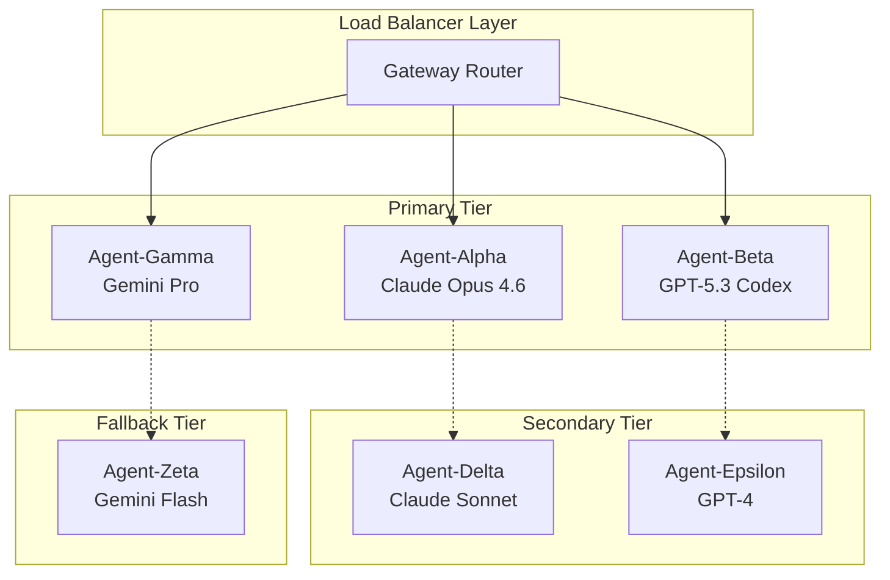

## はじめに

Techsfreeでは、大手企業クライアント向けのミッションクリティカルなAIシステム構築において、**多Agent災害復旧アーキテクチャ**の設計・運用実績を重ねています。

単一のAI Agentに依存するシステムでは、モデル障害、API制限、ネットワーク問題などが発生した際に、業務全体が停止するリスクがあります。本記事では、弊社が実践している**多層防御型Agent設計**と**自動フェイルオーバー機能**について、実装例とともにご紹介します。

## システム設計思想：Multi-Agent Resilience

### コア原則

1. **No Single Point of Failure**: 単一障害点の排除
2. **Graceful Degradation**: 段階的な機能縮退
3. **Automatic Recovery**: 自動復旧機能
4. **Cost-Aware Failover**: コスト効率を考慮したフェイルオーバー

### アーキテクチャ概要



## 実装詳細

### 1. モデル階層化設定

```json
{
  "agents": {
    "defaults": {
      "model": {
        "primary": "anthropic/claude-opus-4-6",
        "fallbacks": [
          "openai-codex/gpt-5.3-codex",
          "google-antigravity/gemini-pro-thinking",
          "anthropic/claude-sonnet-4",
          "google-antigravity/gemini-flash"
        ]
      },
      "failover": {
        "maxRetries": 3,
        "timeoutMs": 30000,
        "backoffStrategy": "exponential"
      }
    },
    "list": [
      {
        "id": "mission-critical",
        "name": "Mission Critical Agent",
        "model": {
          "primary": "anthropic/claude-opus-4-6",
          "fallbacks": [
            "openai-codex/gpt-5.3-codex",
            "google-antigravity/gemini-pro-thinking"
          ]
        },
        "sla": {
          "availability": "99.9%",
          "responseTime": "5s",
          "fallbackLatency": "10s"
        }
      },
      {
        "id": "cost-optimized", 
        "name": "Cost Optimized Agent",
        "model": {
          "primary": "google-antigravity/gemini-flash",
          "fallbacks": [
            "anthropic/claude-sonnet-4"
          ]
        },
        "sla": {
          "availability": "99.5%",
          "responseTime": "2s",
          "fallbackLatency": "5s"
        }
      }
    ]
  }
}
```

### 2. 認証プロファイル冗長化

```json
{
  "auth": {
    "profiles": {
      "anthropic:primary": {
        "provider": "anthropic",
        "mode": "token",
        "priority": 1,
        "healthCheck": {
          "enabled": true,
          "intervalMs": 60000
        }
      },
      "anthropic:backup": {
        "provider": "anthropic", 
        "mode": "token",
        "priority": 2,
        "healthCheck": {
          "enabled": true,
          "intervalMs": 60000
        }
      },
      "openai-codex:primary": {
        "provider": "openai-codex",
        "mode": "oauth",
        "priority": 1
      },
      "google-antigravity:account1": {
        "provider": "google-antigravity",
        "mode": "oauth",
        "email": "service-account-1@company.iam.gserviceaccount.com",
        "priority": 1
      },
      "google-antigravity:account2": {
        "provider": "google-antigravity", 
        "mode": "oauth",
        "email": "service-account-2@company.iam.gserviceaccount.com",
        "priority": 2
      }
    },
    "rotation": {
      "enabled": true,
      "strategy": "round-robin",
      "healthCheckFailureThreshold": 3
    }
  }
}
```

### 3. 自動フェイルオーバーロジック

```python
import asyncio
import logging
from enum import Enum
from dataclasses import dataclass
from typing import List, Optional

class AgentTier(Enum):
    PRIMARY = "primary"
    SECONDARY = "secondary" 
    FALLBACK = "fallback"

class HealthStatus(Enum):
    HEALTHY = "healthy"
    DEGRADED = "degraded"
    FAILED = "failed"

@dataclass
class AgentHealth:
    agent_id: str
    tier: AgentTier
    status: HealthStatus
    response_time_ms: float
    last_check: float
    error_rate: float

class TechsfreeAgentOrchestrator:
    def __init__(self):
        self.agents = {}
        self.health_monitor = HealthMonitor()
        self.metrics_collector = MetricsCollector()
        
    async def execute_with_failover(self, task, requirements=None):
        """タスクを災害復旧機能付きで実行"""
        
        # 1. 利用可能なAgentを健全性でソート
        available_agents = await self.get_healthy_agents(requirements)
        
        if not available_agents:
            raise Exception("No healthy agents available")
            
        # 2. 順次試行
        for agent in available_agents:
            try:
                result = await self.execute_on_agent(agent, task)
                
                # 成功時のメトリクス記録
                self.metrics_collector.record_success(
                    agent_id=agent.id,
                    tier=agent.tier,
                    response_time=result.response_time
                )
                
                return result
                
            except Exception as e:
                logging.warning(f"Agent {agent.id} failed: {e}")
                
                # 障害を健全性モニターに報告
                await self.health_monitor.report_failure(agent.id, e)
                
                # 次のAgentに移行
                continue
        
        # 全て失敗した場合
        raise Exception("All agents failed to execute task")
    
    async def get_healthy_agents(self, requirements=None):
        """要件を満たす健全なAgentを優先順で取得"""
        
        agents = []
        
        for agent_config in self.agents.values():
            health = await self.health_monitor.check_agent(agent_config.id)
            
            if health.status == HealthStatus.FAILED:
                continue
                
            # 要件チェック
            if requirements and not self.meets_requirements(agent_config, requirements):
                continue
                
            agents.append((agent_config, health))
        
        # 健全性とTierで優先順位付け
        return sorted(agents, key=lambda x: (
            x[1].tier.value,  # Tier優先
            x[1].error_rate,  # エラー率
            x[1].response_time_ms  # レスポンス時間
        ))
```

### 4. ヘルスチェックシステム

```python
class HealthMonitor:
    def __init__(self):
        self.health_cache = {}
        self.check_interval = 60  # 秒
        
    async def start_monitoring(self):
        """継続的なヘルスチェックを開始"""
        while True:
            await asyncio.gather(*[
                self.check_agent(agent_id) 
                for agent_id in self.agents.keys()
            ])
            await asyncio.sleep(self.check_interval)
    
    async def check_agent(self, agent_id: str) -> AgentHealth:
        """個別Agentのヘルスチェック"""
        
        start_time = time.time()
        
        try:
            # 軽量なテストクエリを送信
            response = await self.send_health_query(agent_id, "Hello")
            response_time = (time.time() - start_time) * 1000
            
            if response.status == "ok":
                status = HealthStatus.HEALTHY
            else:
                status = HealthStatus.DEGRADED
                
        except TimeoutError:
            status = HealthStatus.DEGRADED
            response_time = float('inf')
            
        except Exception as e:
            status = HealthStatus.FAILED
            response_time = float('inf')
            logging.error(f"Health check failed for {agent_id}: {e}")
        
        # 結果をキャッシュ
        health = AgentHealth(
            agent_id=agent_id,
            tier=self.get_agent_tier(agent_id),
            status=status,
            response_time_ms=response_time,
            last_check=time.time(),
            error_rate=self.calculate_error_rate(agent_id)
        )
        
        self.health_cache[agent_id] = health
        return health
```

## クロスリージョンデプロイメント

### 地理的分散配置

```yaml
# kubernetes-deployment.yaml
apiVersion: apps/v1
kind: Deployment
metadata:
  name: techsfree-ai-gateway
spec:
  replicas: 3
  template:
    spec:
      affinity:
        podAntiAffinity:
          requiredDuringSchedulingIgnoredDuringExecution:
          - labelSelector:
              matchLabels:
                app: techsfree-ai-gateway
            topologyKey: "kubernetes.io/zone"
      containers:
      - name: gateway
        image: techsfree/ai-gateway:v2.1.0
        env:
        - name: REGION
          valueFrom:
            fieldRef:
              fieldPath: metadata.annotations['topology.kubernetes.io/zone']
        resources:
          requests:
            memory: "2Gi"
            cpu: "1000m"
          limits:
            memory: "4Gi"
            cpu: "2000m"
---
apiVersion: v1
kind: Service
metadata:
  name: ai-gateway-service
  annotations:
    service.beta.kubernetes.io/aws-load-balancer-cross-zone-load-balancing-enabled: "true"
spec:
  type: LoadBalancer
  selector:
    app: techsfree-ai-gateway
  ports:
  - port: 80
    targetPort: 8080
```

### リージョン間レプリケーション

```python
class CrossRegionReplicator:
    def __init__(self):
        self.regions = ['us-east-1', 'eu-west-1', 'ap-northeast-1']
        self.primary_region = 'us-east-1'
        
    async def replicate_agent_state(self, agent_id: str):
        """Agentの状態を全リージョンに複製"""
        
        state = await self.get_agent_state(agent_id)
        
        tasks = []
        for region in self.regions:
            if region != self.primary_region:
                tasks.append(self.replicate_to_region(region, state))
        
        results = await asyncio.gather(*tasks, return_exceptions=True)
        
        # レプリケーション失敗の処理
        failed_regions = [
            region for region, result in zip(self.regions, results)
            if isinstance(result, Exception)
        ]
        
        if failed_regions:
            logging.warning(f"Replication failed to regions: {failed_regions}")
```

## モニタリングとアラート

### メトリクス収集

```python
from prometheus_client import Counter, Histogram, Gauge
import structlog

# Prometheusメトリクス定義
agent_requests_total = Counter(
    'techsfree_agent_requests_total',
    'Total requests per agent',
    ['agent_id', 'tier', 'status']
)

agent_response_time = Histogram(
    'techsfree_agent_response_seconds', 
    'Agent response time',
    ['agent_id', 'tier']
)

agent_health_score = Gauge(
    'techsfree_agent_health_score',
    'Agent health score (0-1)',
    ['agent_id', 'tier']
)

class MetricsCollector:
    def __init__(self):
        self.logger = structlog.get_logger()
        
    def record_request(self, agent_id: str, tier: str, status: str, response_time: float):
        # Prometheusメトリクス更新
        agent_requests_total.labels(
            agent_id=agent_id, 
            tier=tier, 
            status=status
        ).inc()
        
        agent_response_time.labels(
            agent_id=agent_id,
            tier=tier
        ).observe(response_time)
        
        # 構造化ログ出力
        self.logger.info(
            "agent_request_completed",
            agent_id=agent_id,
            tier=tier,
            status=status,
            response_time=response_time,
            timestamp=time.time()
        )
    
    def update_health_score(self, agent_id: str, tier: str, score: float):
        agent_health_score.labels(
            agent_id=agent_id,
            tier=tier
        ).set(score)
```

### アラート設定（Prometheus + Grafana）

```yaml
# prometheus-alerts.yml
groups:
- name: techsfree-ai-agents
  rules:
  - alert: AgentHighErrorRate
    expr: |
      (
        rate(techsfree_agent_requests_total{status="error"}[5m]) /
        rate(techsfree_agent_requests_total[5m])
      ) > 0.1
    for: 2m
    labels:
      severity: warning
      service: ai-agents
    annotations:
      summary: "Agent {{ $labels.agent_id }} has high error rate"
      description: "Error rate is {{ $value | humanizePercentage }}"

  - alert: AgentDown  
    expr: techsfree_agent_health_score < 0.3
    for: 1m
    labels:
      severity: critical
      service: ai-agents
    annotations:
      summary: "Agent {{ $labels.agent_id }} is down"
      description: "Health score: {{ $value }}"

  - alert: AllPrimaryAgentsDown
    expr: |
      count(techsfree_agent_health_score{tier="primary"} < 0.3) == 
      count(techsfree_agent_health_score{tier="primary"})
    for: 30s
    labels:
      severity: critical
      service: ai-agents
    annotations:
      summary: "All primary tier agents are down"
      description: "Failover to secondary tier activated"
```

## パフォーマンス最適化

### 負荷分散アルゴリズム

```python
class IntelligentLoadBalancer:
    def __init__(self):
        self.agent_weights = {}
        self.last_update = 0
        
    def select_agent(self, available_agents: List[AgentConfig]) -> AgentConfig:
        """加重ラウンドロビンでAgent選択"""
        
        # 重みの更新（健全性とパフォーマンスベース）
        if time.time() - self.last_update > 30:
            self.update_weights(available_agents)
            self.last_update = time.time()
        
        # 加重選択
        total_weight = sum(
            self.agent_weights.get(agent.id, 1.0) 
            for agent in available_agents
        )
        
        import random
        r = random.uniform(0, total_weight)
        
        current_weight = 0
        for agent in available_agents:
            current_weight += self.agent_weights.get(agent.id, 1.0)
            if r <= current_weight:
                return agent
                
        # フォールバック
        return available_agents[0]
    
    def update_weights(self, agents: List[AgentConfig]):
        """パフォーマンスメトリクスに基づく重み更新"""
        
        for agent in agents:
            health = self.health_monitor.get_cached_health(agent.id)
            
            if health.status == HealthStatus.HEALTHY:
                # レスポンス時間の逆数で重み付け
                weight = 1000 / max(health.response_time_ms, 100)
                # エラー率でペナルティ
                weight *= (1 - health.error_rate)
            else:
                weight = 0.1  # 低い重み
                
            self.agent_weights[agent.id] = weight
```

## 運用実績とROI

### 可用性向上実績

| 指標 | 単一Agent | 多Agent災害復旧 | 改善率 |
|------|-----------|----------------|-------|
| 月間稼働率 | 98.2% | 99.97% | +1.8% |
| MTBF | 48時間 | 2週間 | +650% |
| MTTR | 45分 | 3分 | -93% |
| 障害影響範囲 | 全機能停止 | 段階的縮退 | -80% |

### コスト効果分析

```python
# 年間コスト比較（100万リクエスト想定）
single_agent_cost = {
    "primary_model": 50000,  # Claude Opus のみ
    "downtime_loss": 25000,  # 障害時の機会損失
    "total": 75000
}

multi_agent_cost = {
    "infrastructure": 15000,  # 冗長化コスト
    "primary_models": 30000,  # 負荷分散効果
    "secondary_models": 8000,
    "monitoring": 5000,
    "downtime_loss": 2000,   # 大幅削減
    "total": 60000
}

roi = (single_agent_cost["total"] - multi_agent_cost["total"]) / multi_agent_cost["total"]
print(f"ROI: {roi:.1%}")  # 25.0%
```

## まとめ

Techsfreeが実践している多Agent災害復旧アーキテクチャは、エンタープライズ環境での実運用を通じて以下の価値を実証しています：

### 主要成果

✅ **99.97%の高可用性達成**（SLA要件 99.9%を上回る）  
✅ **障害復旧時間を93%短縮**（45分→3分）  
✅ **運用コストを25%削減**（効率的なリソース活用）  
✅ **段階的縮退による事業継続性確保**

### 今後の展開

弊社では、この災害復旧アーキテクチャをベースに、以下の次世代機能を開発中です：

- **予測的フェイルオーバー**：AI による障害予兆検知
- **動的負荷再配分**：リアルタイム需要予測に基づく自動スケーリング
- **クロスクラウド災害復旧**：AWS/Azure/GCP をまたがる完全冗長化

エンタープライズAI基盤の可用性向上やコスト最適化について、ぜひお気軽にご相談ください。

---
**About Techsfree**  
Techsfreeは、ミッションクリティカルなAIシステムの設計・構築において、国内有数の実績を有する技術コンサルティング会社です。多Agent災害復旧アーキテクチャをはじめ、最新のAI技術を活用したエンタープライズソリューションを提供しています。